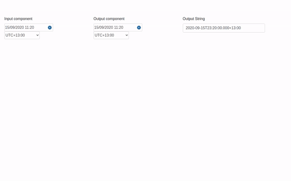

<h2 align="center">Dash Cool Components</h2>

<p align="center">
  Cool React components, wrapped for Plotly Dash
</p>

[](https://badge.fury.io/py/dash-cool-components)

## Table of contents

- [Installation](#installation)
- [Quick Start](#quickstart)

## Installation

```sh
pip install dash-cool-components
```

## Components

<details>
  <summary>
    <strong>Datetime Picker</strong>
  </summary>

  A date-time-timezone picker input. Implemented with the [React Datepicker](https://www.npmjs.com/package/react-datepicker) and
  [Timezone Picker React](https://www.npmjs.com/package/react-bootstrap-timezone-picker) components.
  
  ### Component Properties:  
    
  | Argument | Value | Description |
  |---|---|---|
  | id | string | The ID used to identify this component in Dash callbacks. |
  | value | string | The input's current value, on ISO format with date, time and timezone. |
  | renderTimezone | boolean | Defines if the timezone input should be rendered. Defaults to true. |
  | placeholder | string | The date input placeholder. |
  | timezonePlaceholder | string | The timezone input placeholder. |
  | style | object or string | The component container's style. Can be a style object or a css string. |
  | dateInputStyle | object or string | The date input's style. Can be a style object or a css string. |
  | timezoneInputStyle | object | The timezone container's style. Must be a style object. |

  [Example File](https://github.com/Tauffer-Consulting/dash-cool-components/blob/master/example_DateTimePicker.py)

  
</details>


<details>
  <summary>
    <strong>Keyed File Browser</strong>
  </summary>

  File and directory browser given a flat keyed list of objects. Implemented with
  [React Keyed File Browser](https://github.com/uptick/react-keyed-file-browser).
  
  ### Component Properties
  
  | Argument | Value | Description |
  |---|---|---|
  | id | string | The ID used to identify this component in Dash callbacks. |
  | selectedPath | string | The current selected path in the file tree. |
  | files | array | The file tree to be displayed in the browser. Each entry in the array must be an object with the `key` property, which specifies it's location in the tree. Otherproperties are `modified` and `size`. To be able to receive the path selection feedback, you must enter keys for both files and folders. |
   
    
  [Example File](https://github.com/Tauffer-Consulting/dash-cool-components/blob/master/example_KeyedFileBrowser.py)
  
  
</details>

<details>
  <summary>
    <strong>Tag Input</strong>
  </summary>

  A tag input component. Implemented with [React Tag Input](https://github.com/leekevinyg/react-tag-input).
  
  ### Components Properties
  
  | Argument | Value | Description |
  |---|---|---|
  | id | string | The ID used to identify this component in Dash callbacks |
  | wrapperStyle | object or string | The component wrapper's style. Can be either a style object or a CSS string. |
  | tagStyle | object or string | The tag's style. Can be either a style object or a CSS string |
  | inputStyle | object or string | The text input's style. Can be either a style object or a CSS string. |
  | tagDeleteStyle | object or string | The tag delete button's style. Can be either a style object or a CSS string. |
  | placeholder | string | Placeholder for the text input |
  | placeholder | string | Placeholder for the text input |
  | value | array | The input's current tags array of objects. e.g [{"index": 0, "displayValue": "Tag"}] |
  | injectedTags | array | Tags to be inserted on the input. The input's atual tags are replaced. |

    
  [Example File](https://github.com/Tauffer-Consulting/dash-cool-components/blob/master/example_TagInput.py)
 
  
</details>
