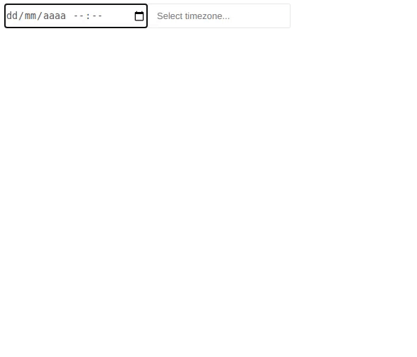
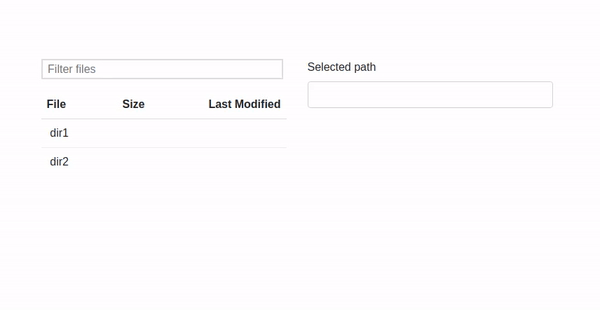
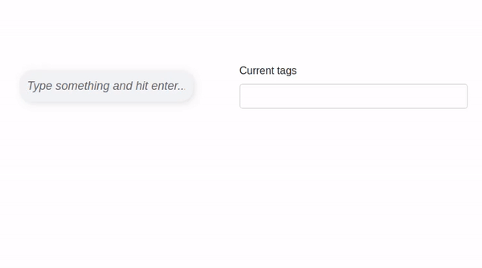

<h2 align="center">Dash Cool Components</h2>

<p align="center">
  Cool React components, wrapped for Plotly Dash
</p>

[](https://badge.fury.io/py/dash-cool-components)

## Table of contents

- [Installation](#installation)
- [Quick Start](#quickstart)

## Installation

```sh
pip install dash-cool-components
```

## Components

<details>
  <summary>
    <strong>Datetime Picker</strong>
  </summary>

  A date-time-timezone picker input. Implemented with the [React Datepicker](https://www.npmjs.com/package/react-datepicker) and
  [Timezone Picker React](https://www.npmjs.com/package/react-bootstrap-timezone-picker) components.
  
  ### Component Properties:  
    
  **The ID used to identify this component in Dash callbacks.**
  * id: string  
  
  **The input's current value, on ISO format with date, time and timezone.**  
  * value: string
  
  **Defines if the timezone input should be rendered. Defaults to true.**  
  * renderTimezone: boolean

  **The date input placeholder.**
  * placeholder: string

  **The timezone input placeholder.**
  * timezonePlaceholder: string

  **The component container's style. Can be a style object or a css string.**  
  * style: object | string

  **The date input's style. Can be a style object or a css string.**  
  * dateInputStyle: object | string

  **The timezone container's style. Must be a style object.**  
  * timezoneInputStyle: object  

  ```
  import dash
  import dash_html_components as html
  import dash_cool_components

  app = dash.Dash(__name__)

  app.layout = html.Div([
      dash_cool_components.DateTimePicker(
              id='timezone',
              renderTimezone=True,
          ), width={'size':4}
      html.Div(id='output')
  ])
  
  @app.callback(Output('output', 'children'), [Input('input', 'value')])
  def display_output(value):
      if value is not None:
          output_div = html.Div([
              html.H4('Datetime: {}'.format(value['datetime'])),
              html.H4('Timezone: {}'.format(value['timezone']))
          ])
          return output_div

  if __name__ == '__main__':
      app.run_server(debug=True)

  ```

  
</details>


<details>
  <summary>
    <strong>Keyed File Browser</strong>
  </summary>

  File and directory browser given a flat keyed list of objects. Implemented with
  [React Keyed File Browser](https://github.com/uptick/react-keyed-file-browser).
  
  ### Component Properties
    
  **The ID used to identify this component in Dash callbacks.**  
  * id: string

  **The current selected path in the file tree.**  
  * selectedPath: string

  **The file tree to be displayed in the browser. Each entry in the array must be an object with the `key` property, which specifies it's location in the tree. Otherproperties are `modified` and `size`. To be able to receive the path selection feedback, you must enter keys for both files and folders.**  
  * files: array
    
  [Example File](https://github.com/Tauffer-Consulting/dash-cool-components/blob/master/example_KeyedFileBrowser.py)
  
  
</details>

<details>
  <summary>
    <strong>Tag Input</strong>
  </summary>

  A tag input component. Implemented with [React Tag Input](https://github.com/leekevinyg/react-tag-input).
  
  ### Components Properties
    
  **The ID used to identify this component in Dash callbacks.**  
  * id: string

  **The component wrapper's style. Can be either a style object or a CSS string.**  
  * wrapperStyle: object  
  
  **The tag's style. Can be either a style object or a CSS string.**  
  * tagStyle: object

  **The text input's style. Can be either a style object or a CSS string.**  
  * inputStyle: object

  **The tag delete button's style. Can be either a style object or a CSS string.**  
  * tagDeleteStyle: object

  **Placeholder for the text input.**  
  * placeholder: string

  **The input's current tags.**
  * value: array

  **Tags to be inserted on the input. The input's atual tags are replaced.**
  * injectedTags: array
    
  [Example File](https://github.com/Tauffer-Consulting/dash-cool-components/blob/master/example_TagInput.py)
 
  
</details>
