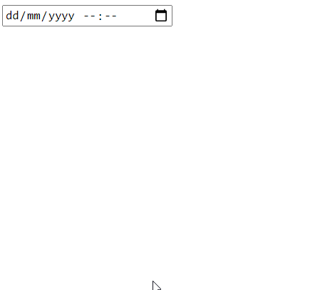
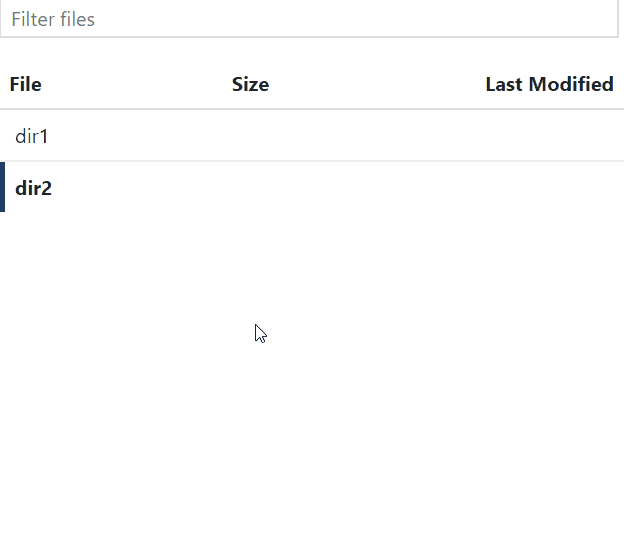
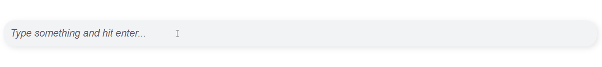

<h2 align="center">Dash Cool Components</h2>

<p align="center">
  Cool React components, wrapped for Plotly Dash
</p>

[](https://badge.fury.io/py/dash-cool-components)

## Table of contents

- [Installation](#installation)
- [Quick Start](#quickstart)

## Installation

```sh
pip install dash-cool-components
```

## Components

<details>
  <summary>
    <strong>Datatime Picker</strong>
  </summary>

  A date-time picker.
  [Source React component]().

  ```
  import dash
  import dash_html_components as html
  import dash_cool_components

  app = dash.Dash(__name__)

  my_component = dash_cool_components.DateTimePicker(id='date_time_picker')
  app.layout = html.Div(my_component)

  if __name__ == '__main__':
      app.run_server(debug=True)

  ```

  
</details>


<details>
  <summary>
    <strong>Keyed File Browser</strong>
  </summary>

  File and directory browser given a flat keyed list of objects.
  [Source React component](https://github.com/uptick/react-keyed-file-browser).

  ```
  import dash
  import dash_html_components as html
  import dash_bootstrap_components as dbc
  import dash_cool_components


  external_stylesheets = [dbc.themes.BOOTSTRAP]
  app = dash.Dash(__name__, external_stylesheets=external_stylesheets)

  dir_dict = [
      {'key': 'dir1/my_image.jpeg', 'size': 2782874},
      {'key': 'dir2/other_image.tif', 'size': 499240007}
  ]

  my_component = dash_cool_components.FileExplorer(
      id='file_explorer',
      value=dir_dict,
  )
  app.layout = html.Div(my_component, style={'width': '500px'})

  if __name__ == '__main__':
      app.run_server(debug=True)

  ```

  
</details>

<details>
  <summary>
    <strong>Tag Input</strong>
  </summary>

  A tag input component.
  [Source React component](https://github.com/leekevinyg/react-tag-input).

  ```
  import dash
  import dash_html_components as html
  import dash_cool_components

  app = dash.Dash(__name__)

  my_component = dash_cool_components.Keywords(id='tag_input')
  app.layout = html.Div(my_component)

  if __name__ == '__main__':
      app.run_server(debug=True)

  ```

  
</details>
